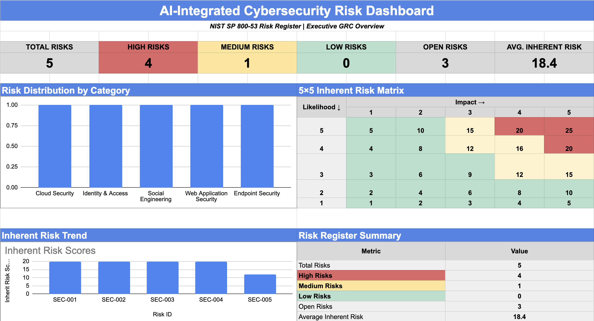
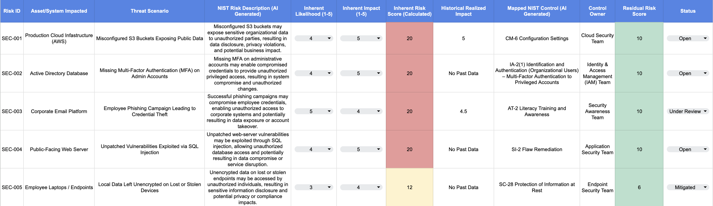
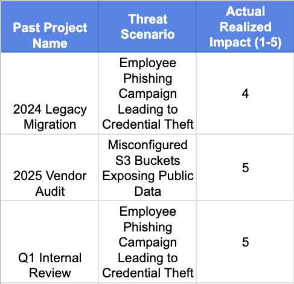

# AI-Integrated NIST Cybersecurity Risk Register

> **GRC / Cyber Risk Portfolio Project | Simulated Environment**

## 📊 Interactive Project

**[View the Interactive Risk Register](YOUR-GOOGLE-SHEETS-LINK)**

*View-only Google Sheets portfolio demonstration.*

---

## Overview

A simulated GRC portfolio project demonstrating an AI-assisted cybersecurity risk-management workflow aligned with **NIST SP 800-53**.

The project models an end-to-end risk workflow from threat identification and inherent risk assessment through NIST control mapping, control ownership, residual risk assessment, and executive reporting.

## Project Objectives

- Identify and document cybersecurity risks
- Assess inherent likelihood and impact
- Incorporate historical risk evidence
- Map risks to NIST SP 800-53 controls
- Assign control ownership
- Calculate residual risk
- Present risk information through an executive dashboard
- Demonstrate AI-assisted GRC workflows

## Framework

**NIST SP 800-53**

## Project Components

- Risk Register
- Historical Risk Data
- AI-Assisted Risk Descriptions
- NIST Control Mapping
- Residual Risk Assessment
- Executive Risk Dashboard
- 5×5 Risk Matrix
- Risk Distribution Visualization

## AI Methodology

AI was used to assist with the generation of audit-ready risk descriptions and NIST control mappings using standardized prompts.

AI-generated outputs were reviewed and validated by the analyst before being incorporated into the risk register.

## Risk Assessment Methodology

### Inherent Risk

Inherent risk is calculated using:

**Likelihood × Impact = Inherent Risk Score**

Risk thresholds used in the project:

- 🟢 **Low:** 1–11
- 🟡 **Medium:** 12–19
- 🔴 **High:** 20–25

### Residual Risk

Residual risk scores use a project-defined methodology to demonstrate the potential effect of mitigating controls.

This methodology is for portfolio demonstration purposes and does not represent an organizational risk determination or a NIST-prescribed scoring formula.

## Dashboard

The executive dashboard provides a visual summary of:

- Total risks
- High, medium, and low risk distribution
- Open risks
- Average inherent risk
- Inherent risk scores by risk
- 5×5 risk matrix
- Risk distribution by category

## Screenshots

### Executive Dashboard

### Risk Register

### Historical Risk Data

## Skills Demonstrated

- GRC
- Cybersecurity Risk Assessment
- NIST SP 800-53
- Risk Analysis
- Control Mapping
- Residual Risk Assessment
- Security Governance
- AI-Assisted GRC
- Executive Risk Reporting
- Google Sheets

## Disclaimer

This project uses simulated risks, assets, historical data, and organizational roles for educational and portfolio purposes.

It does not represent an actual organization's security environment or risk determination.
